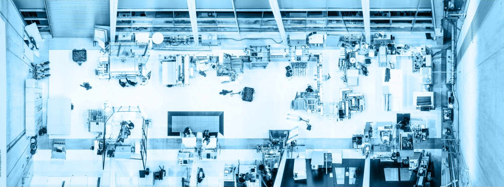

# Markdown Samples

Please find more samples here: https://pmarsceill.github.io/just-the-docs/docs/ui-components

## Text

Lorem ipsum dolor sit amet, consectetur adipisicing elit, sed do eiusmod tempor incididunt ut labore et dolore magna aliqua. Ut enim ad minim veniam, quis nostrud exercitation ullamco laboris nisi ut aliquip ex ea commodo consequat. Duis aute irure dolor in reprehenderit in voluptate velit esse cillum dolore eu fugiat nulla pariatur. Excepteur sint occaecat cupidatat non proident, sunt in culpa qui officia deserunt mollit anim id est laborum.

## Headings

# h1 Heading
## h2 Heading
### h3 Heading
#### h4 Heading
##### h5 Heading
###### h6 Heading

## Emphasis

**This is bold text**

__This is bold text__

*This is italic text*

_This is italic text_

~~Strikethrough~~

## Blockquotes

> Blockquotes level 1
>> Blockquotes level 2
> > > Blockquotes level 3

## Lists

Unordered

- Create list with `+`, `-`, or `*`
- Sub-list:
  + Entry 1
  + Entry 2
- ...

Ordered

1. Lorem ipsum dolor sit amet
2. Consectetur adipiscing elit
3. 3. Integer molestie lorem at massa

1. Use sequential numbers ...
1. or just repeat `1.`

Task List
- [ ] todo item
- [ ] another todo item
- [x] this item is done

## Code

Inline `code`

Block code

```
Svar foo = function (bar) {
  return bar++;
};
```

Syntax highlighting

```js
var foo = function (bar) {
  return bar++;
};
```

## Labels

Default label
{: .label }

Blue label
{: .label .label-blue }

Stable
{: .label .label-green }

New release
{: .label .label-purple }

Coming soon
{: .label .label-yellow }

Deprecated
{: .label .label-red }

## Buttons

[Link button](http://example.com/){: .btn }

[Link button](http://example.com/){: .btn .btn-purple }
[Link button](http://example.com/){: .btn .btn-blue }
[Link button](http://example.com/){: .btn .btn-green }

[Link button](http://example.com/){: .btn .btn-outline }

## Tables

| head1        | head two          | three |
|:-------------|:------------------|:------|
| ok           | good swedish fish | nice  |
| out of stock | good and plenty   | nice  |
| ok           | good `oreos`      | hmm   |
| ok           | good `zoute` drop | yumm  |

## Images


